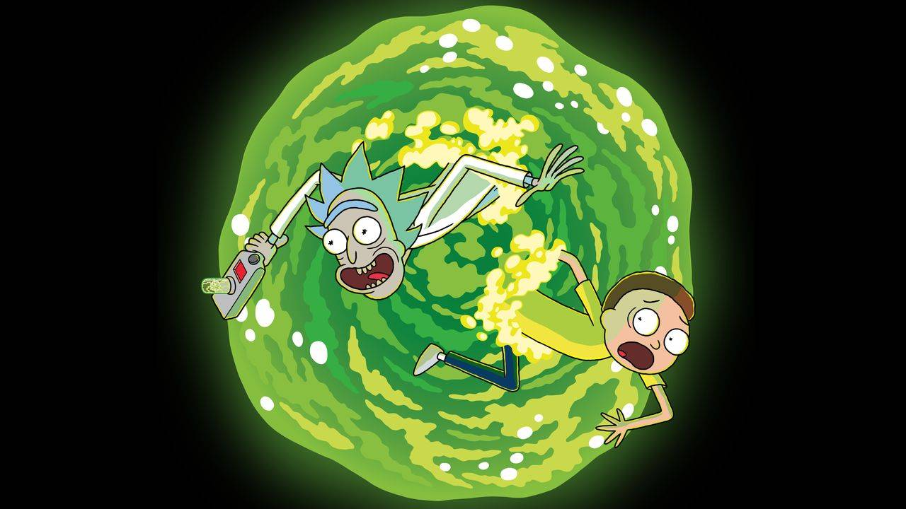
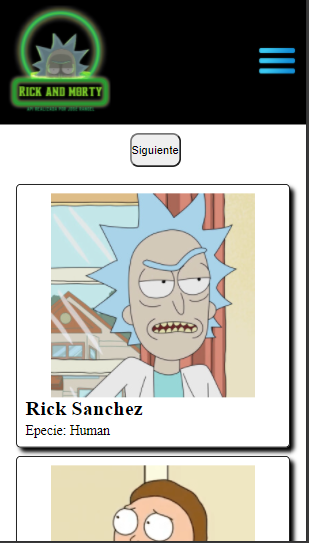
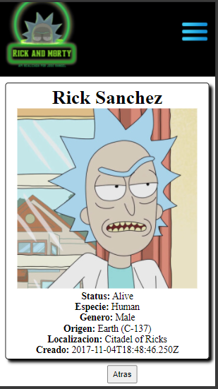
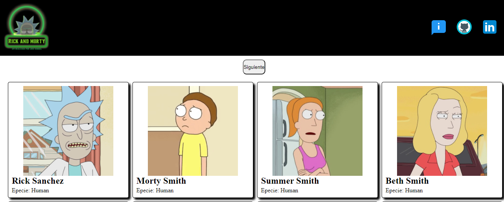

# SPA Rick And Morty

Este repositorio tenia muchas ganas de hacerlo ya que me he visto la serie, ademas que cuenta con 826 personajes los cuales podemos ver los detalles con respecto a la serie.

## Informacion

La siguiente SPA fue realizada con las siguientes tecnoligias:

HTML
CSS
 JavaScript
React

### `La SPA cuenta con:`

- Landing principal.
- Responsividad.
- Paginacion.
- Routing.
- Consumo de API [RickandMorty](https://rickandmortyapi.com/)

## Pantallas

